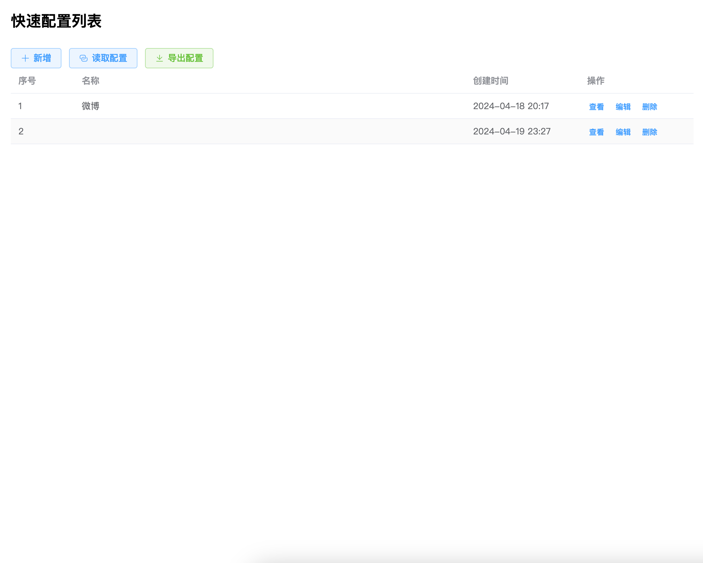
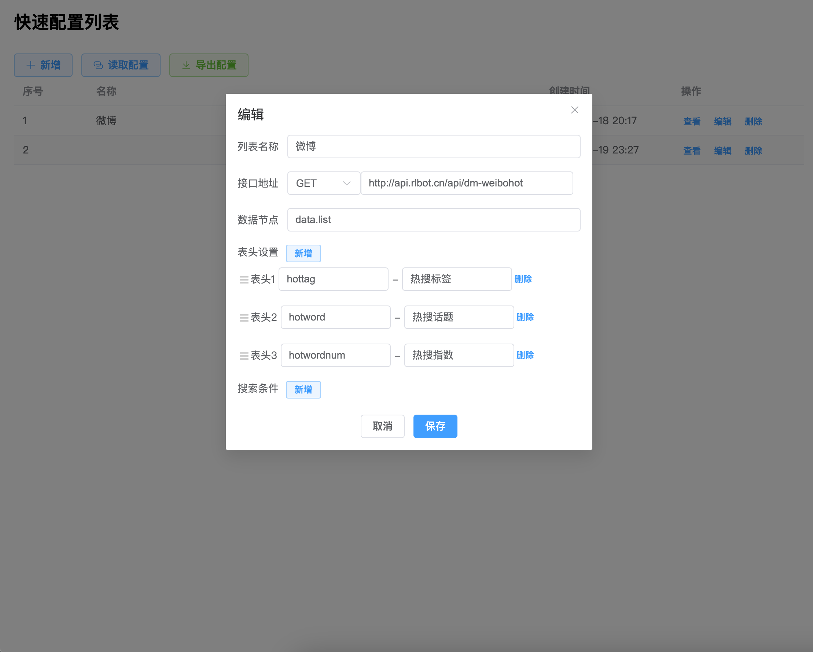
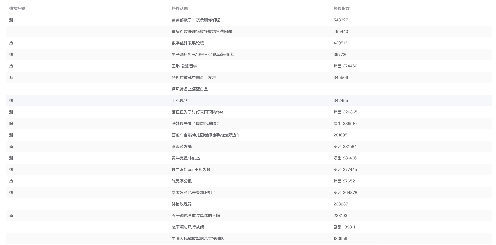
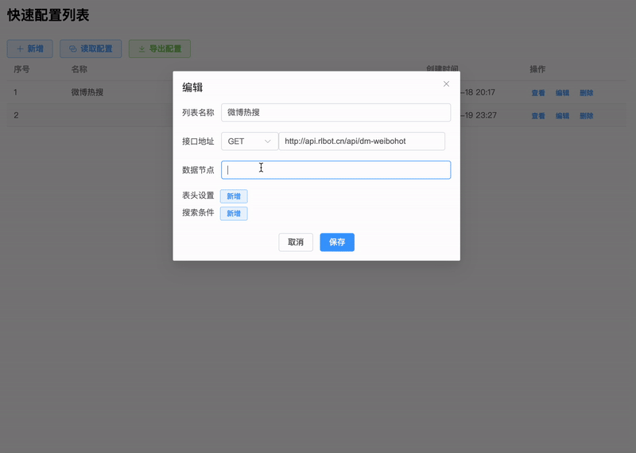

# 快速配置列表

- 纯前端项目，所有配置保存在 localstorage 中，清除 localstorage 前自行导出配置保存
- 导出的配置可复制后，在页面中读取配置，并允许读取剪切板，即可实现导入配置
- 快速配置接口地址，字段对应列便可查看，接口支持 GET、POST 请求
- 填写接口地址及数据根节点后，自动解析接口，并将所有字段自动填入到表头配置中，只需填写列名
- 支持添加搜索条件，添加搜索条件后，点击查看时，会弹窗提示输入搜索条件
- 列和搜索条件顺序可通过拖动实现调整顺序


## 待完成
- 支持添加操作列，自定义操作，实现列表中查看、删除等操作
- 添加多选列及操作栏，可多选操作
- 列表字段格式化，添加时间、数字格式化等


## 部分截图




## 运行步骤
- 下载源码
- 使用 pnpm 安装依赖
  ```
  pnpm i 
- 运行
  ```
  pnpm run dev
pnpm 安装命令
``` 
    npm install -g pnpm
```
打包命令
```
    pnpm run build